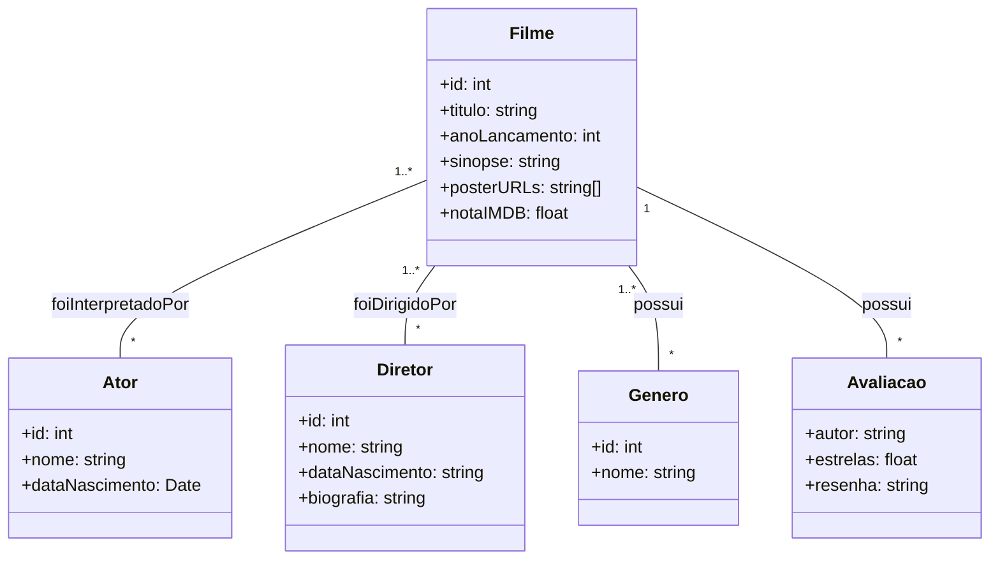

# Api-Cinema-Positivo2025

Repositório para a concretização de um projeto API em grupo advindo da matéria de Tópicos Especiais
de Sistemas no curso de Análise e Desenvolvimeto de Sistemas.

Universidade Positivo, 2025.

## Diagrama de classes da API

